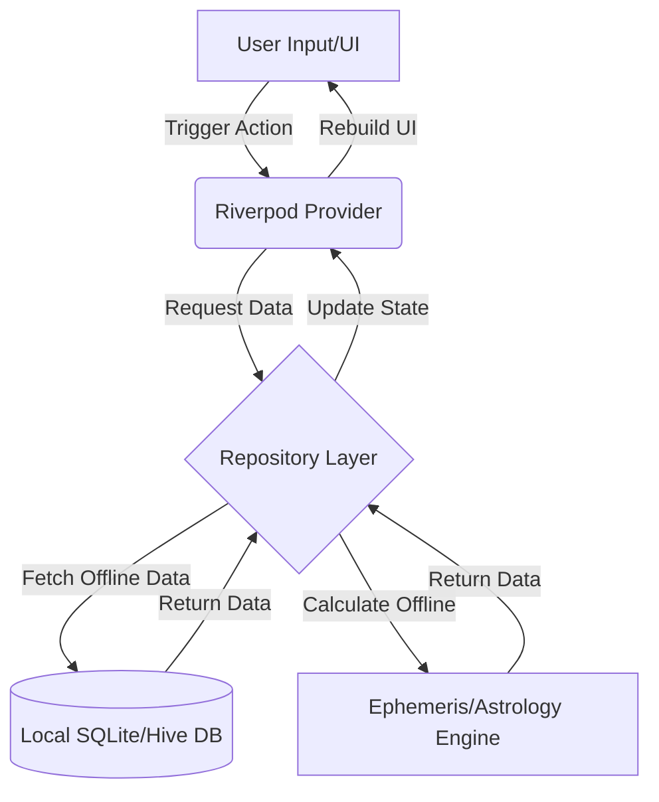

# CosmicVed — Vedic Astrology & Numerology Companion


**CosmicVed** is a beautifully designed, premium Flutter application that bridges the gap between ancient Vedic wisdom and modern technology. Crafted with a focus on deep astrological accuracy, stunning aesthetics, and absolute privacy, CosmicVed offers users a personalized window into their cosmic and numerological profiles.

---

## 📖 Brief Description
CosmicVed serves as a comprehensive spiritual and astrological companion. By generating highly accurate Vedic Kundali (Birth Charts), daily Panchang data, Chaldean numerology insights, and authentic compatibility matching (Ashtakoota Guna Milan), the app empowers users with profound cosmic knowledge. 

## ⚠️ Problem Statement
Modern astrology apps often suffer from several critical issues:
1. **Privacy Concerns:** They require mandatory user accounts, internet connectivity, and often store highly sensitive personal birth data on remote servers.
2. **Cluttered UI/UX:** Many apps have outdated, overwhelming interfaces that make it difficult for users to interpret complex astrological data.
3. **Inaccuracy & Latency:** Relying on constant API calls for astrological calculations leads to slow load times, subscription paywalls, and unavailability when offline.
4. **Lack of Authenticity:** Many modern apps dilute traditional Vedic concepts or mix systems inaccurately.

## 💡 Proposed Solution
CosmicVed solves these problems by providing an entirely **on-device astrology engine**. 
- **Privacy First:** No accounts are required. All user profiles and astrological data are stored securely on the local device using SQLite and Hive.
- **Modern Aesthetics:** The app features a premium, space-themed UI with deep space colors, glassmorphism, dynamic starfields, and smooth micro-animations.
- **Offline Reliability:** By shipping with a bundled offline Geonames database and utilizing the Swiss Ephemeris (`sweph`) engine, charts and calculations are generated instantly without an internet connection.
- **Authentic Calculations:** Utilizes precise astronomical algorithms to calculate planetary positions, ascendant degrees, authentic Chaldean numerology, and deep Vedic mapping like Pancha Pakshi and Ashtakoota.

## ✨ Unique Features
- **Instant Offline Kundali Generation:** Generates full Vedic birth charts instantly in North Indian (Diamond), South Indian (Grid), and East Indian chart styles.
- **Deep Compatibility Matching (Guna Milan):** Features an authentic Ashtakoota compatibility calculator that dynamically analyzes the 36 Gunas, offering detailed strengths, challenges, and percentage-based synergy between profiles.
- **Cosmic Roots Identification:** Maps a user's exact Nakshatra and Rashi to their traditional Vedic identifiers: Gana (Temperament), Yoni (Animal), Pakshi (Bird), Vriksha (Tree), and Ratna (Birth Stone).
- **Chaldean Numerology Engine:** Generates comprehensive Destiny, Soul Urge, and Personality numbers based on ancient Chaldean mapping.
- **Dynamic Starfield Backgrounds:** A highly optimized, custom-painted parallax star background that reacts seamlessly to scrolling and gestures.
- **Multi-Profile Management:** Seamlessly add, switch, and manage multiple user profiles with smooth animated transitions.

---

## 🏛️ Architecture
CosmicVed follows a **Feature-First Architecture** combined with the **Repository Pattern** and **Riverpod** for state management. This ensures high cohesion, loose coupling, and maintainability.

```text
lib/
├── config/         # App routing (GoRouter), theme configuration
├── constants/      # App-wide constants, enums, astrology lookup tables
├── database/       # Local database configuration (SQLite, DAOs)
├── features/       # Feature-driven modules (compatibility, dashboard, kundali, numerology, panchang, etc.)
│   └── [feature]/
│       ├── providers/  # Riverpod state providers for the specific feature
│       ├── screens/    # UI screens
│       └── widgets/    # Feature-specific widgets
├── models/         # Data models with JSON serialization
├── repositories/   # Data access layer (abstracts DB and API calls)
├── services/       # Core business logic (Ephemeris, Geolocation, Compatibility, Cosmic Roots)
├── theme/          # Deep space color schemes, typography, and visual assets
└── widgets/        # Shared/global UI components (Buttons, Cards, Starfields)
```

## 🔄 Workflow
1. **Onboarding & Profile Creation:** The user launches the app and is greeted by a cinematic welcome screen. They create a profile by entering their Name, Gender, Date of Birth, Time of Birth (via a custom dialer), and City (resolved via a bundled offline Geonames SQLite database).
2. **Dashboard Initialization:** The app reads the active profile from local storage and instantly calculates the daily Panchang, Cosmic Roots, and core astrological metrics.
3. **Feature Navigation:** The user can seamlessly switch between Vedic Kundali, Chaldean Numerology, Compatibility Matching, Daily Panchang, and Profile Management without any loading screens.
4. **Profile Switching:** When switching profiles, the `activeProfileProvider` is invalidated, causing the UI to smoothly transition and recalculate all charts for the newly selected user.

---

## 🗄️ Database Design
The app utilizes a dual-database approach for optimal performance and flexibility:

### 1. SQLite (Geonames DB)
Used as a read-only, bundled database to provide offline city search, coordinates, and timezone lookups instantly.
- **Table `cities`**: `id` (INT), `name` (TEXT), `country_code` (TEXT), `latitude` (REAL), `longitude` (REAL), `timezone_id` (TEXT)

### 2. SQFlite / Hive (User Data)
Used for read/write operations pertaining to user profiles and app settings.
- **Table `user_profiles`**: 
  - `id` (INTEGER PRIMARY KEY)
  - `name` (TEXT)
  - `gender` (TEXT)
  - `date_of_birth` (TEXT)
  - `time_of_birth` (TEXT)
  - `birth_city` (TEXT)
  - `latitude` (REAL)
  - `longitude` (REAL)
  - `timezone_id` (TEXT)
  - `is_active` (INTEGER - Boolean)

---

## 📊 Diagrams

### High-Level State Flow


---

## 🛠️ Tech Stack Used
- **Framework:** [Flutter](https://flutter.dev/) (SDK >=3.3.0)
- **Language:** [Dart](https://dart.dev/)
- **State Management:** [Riverpod](https://riverpod.dev/) (`flutter_riverpod`, `riverpod_annotation`)
- **Routing:** [GoRouter](https://pub.dev/packages/go_router)
- **Local Database:** [SQFlite](https://pub.dev/packages/sqflite), [Hive](https://pub.dev/packages/hive)
- **Astrology Engine:** [sweph](https://pub.dev/packages/sweph) (Swiss Ephemeris port)
- **Animations:** `flutter_animate`, custom `CustomPainter` implementations
- **Code Generation:** `freezed`, `json_serializable`, `build_runner`

---

## 🚀 How to Install & Run

### Prerequisites
- [Flutter SDK](https://docs.flutter.dev/get-started/install) installed (version 3.3.0 or higher).
- Android Studio or Xcode installed for the respective emulators/devices.
- A physical device or emulator running.

### Installation Steps
1. **Clone the repository**
   ```bash
   git clone https://github.com/karanks6/CosmicVed.git
   cd CosmicVed
   ```

2. **Get Dependencies**
   Fetch all required Dart packages.
   ```bash
   flutter pub get
   ```

3. **Run Code Generation**
   Since the project uses `freezed` and `riverpod_annotation`, you need to generate the necessary files.
   ```bash
   dart run build_runner build --delete-conflicting-outputs
   ```

4. **Run the App**
   For the best performance and to see the animations smoothly, it is highly recommended to run the app in **Release Mode** or **Profile Mode** on a physical device.
   ```bash
   flutter run --release
   ```

---
*Developed with a focus on performance, privacy, and the timeless beauty of the cosmos.*
