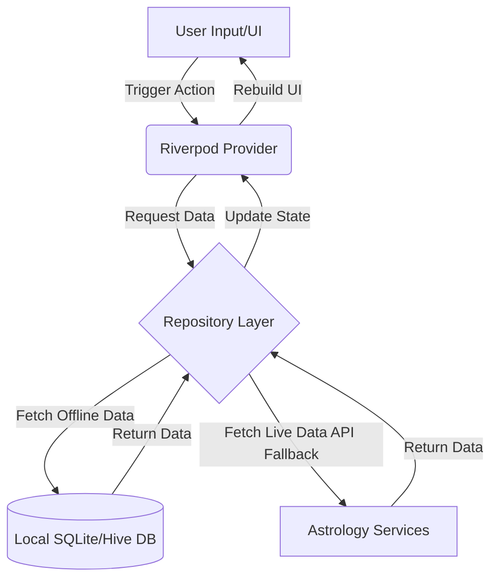

# CosmicVed — Vedic Astrology & Numerology Companion


**CosmicVed** is a beautifully designed, 100% offline-first Flutter application that brings the ancient wisdom of Vedic Astrology and Chaldean Numerology into the modern era. The app is crafted with a focus on deep astrological insights, premium user experience, and absolute privacy.

---

## 📖 Brief Description
CosmicVed offers users a personalized window into their astrological and numerological profiles. By generating accurate Vedic Kundali (Birth Charts) in North, South, and East Indian styles, providing daily Panchang data, calculating Chaldean numerology insights, and offering compatibility matching (Ashtakoota Guna Milan), the app serves as a comprehensive spiritual and astrological companion.

## ⚠️ Problem Statement
Modern astrology apps often suffer from several critical issues:
1. **Privacy Concerns:** They require user accounts, internet connectivity, and often store highly sensitive birth data on remote servers.
2. **Cluttered UI/UX:** Many apps have outdated, overwhelming interfaces that make it difficult for users to interpret complex astrological data.
3. **Inaccuracy & Latency:** Relying on constant API calls for astrological calculations leads to slow load times and unavailability when offline.
4. **Lack of Authenticity:** Many modern apps dilute traditional Vedic concepts or mix systems inaccurately.

## 💡 Proposed Solution
CosmicVed solves these problems by providing an entirely on-device astrology engine. 
- **Privacy First:** No accounts are required, and all user profiles and astrological data are stored securely on the local device using SQLite and Hive.
- **Modern Aesthetics:** The app features a premium, space-themed UI with glassmorphism, dynamic starfields, and smooth micro-animations.
- **Offline Reliability:** By shipping with a local Geonames database and utilizing an offline ephemeris engine, charts and calculations are generated instantly without an internet connection.
- **Authentic Calculations:** Utilizes precise astronomical algorithms to calculate planetary positions, ascendant degrees, and authentic Chaldean numerology values.

## ✨ Unique Features
- **Instant Offline Kundali Generation:** Generates full Vedic birth charts instantly using an integrated ephemeris and local timezone/coordinate resolution.
- **Interactive Dials & Selectors:** Custom-built UI components like the rotating Material 3 dialer for time selection.
- **Multi-Profile Management:** Seamlessly add, switch, and delete multiple user profiles with smooth animated transitions.
- **Dynamic Starfield Backgrounds:** A highly optimized, custom-painted parallax star background that reacts to scrolling.
- **Three-Style Charts:** Support for rendering North Indian (Diamond), South Indian (Grid), and East Indian chart styles.

---

## 🏛️ Architecture
CosmicVed follows a **Feature-First Architecture** combined with the **Repository Pattern** and **Riverpod** for state management. This ensures high cohesion, loose coupling, and testability.

```text
lib/
├── config/         # App routing (GoRouter), theme configuration
├── constants/      # App-wide constants, enums, astrology lookup tables
├── features/       # Feature-driven modules (dashboard, kundali, panchang, etc.)
│   └── [feature]/
│       ├── providers/  # Riverpod state providers for the specific feature
│       ├── screens/    # UI screens
│       └── widgets/    # Feature-specific widgets
├── models/         # Data models with JSON serialization
├── repositories/   # Data access layer (abstracts DB and API calls)
├── services/       # Core business logic (Ephemeris, Astrology API, Geolocation)
├── theme/          # Color schemes, typography, and visual assets
└── widgets/        # Shared/global UI components (Buttons, Cards, Starfields)
```

## 🔄 Workflow
1. **Onboarding & Profile Creation:** The user launches the app and is greeted by a cinematic welcome screen. They create a profile by entering their Name, Gender, Date of Birth, Time of Birth (via a custom dialer), and City (resolved via a bundled offline Geonames SQLite database).
2. **Dashboard Initialization:** The app reads the active profile from local storage and instantly calculates the daily Panchang and core astrological metrics.
3. **Feature Navigation:** The user can seamlessly switch between Vedic Kundali, Chaldean Numerology, Daily Panchang, and Profile Management without any loading screens, as data is computed on the fly or cached locally.
4. **Profile Switching:** When switching profiles, the `activeProfileProvider` is invalidated, causing the UI to smoothly transition and recalculate all charts for the newly selected user.

---

## 🗄️ Database Design
The app utilizes a dual-database approach for optimal performance and flexibility:

### 1. SQLite (Geonames DB)
Used as a read-only, bundled database to provide offline city search, coordinates, and timezone lookups.
- **Table `cities`**: `id` (INT), `name` (TEXT), `country_code` (TEXT), `latitude` (REAL), `longitude` (REAL), `timezone_id` (TEXT)

### 2. SQFlite / Hive (User Data)
Used for read/write operations pertaining to user profiles and app settings.
- **Table `user_profiles`**: 
  - `id` (INTEGER PRIMARY KEY)
  - `name` (TEXT)
  - `gender` (TEXT)
  - `date_of_birth` (TEXT)
  - `time_of_birth` (TEXT)
  - `birth_city` (TEXT)
  - `birth_country` (TEXT)
  - `latitude` (REAL)
  - `longitude` (REAL)
  - `timezone_id` (TEXT)
  - `utc_offset_minutes` (INTEGER)
  - `is_active` (INTEGER - Boolean)

---

## 📊 Diagrams

### High-Level State Flow


---

## 🛠️ Tech Stack Used
- **Framework:** [Flutter](https://flutter.dev/) (SDK >=3.3.0)
- **Language:** [Dart](https://dart.dev/)
- **State Management:** [Riverpod](https://riverpod.dev/) (`flutter_riverpod`, `riverpod_annotation`)
- **Routing:** [GoRouter](https://pub.dev/packages/go_router)
- **Local Database:** [SQFlite](https://pub.dev/packages/sqflite), [Hive](https://pub.dev/packages/hive)
- **Local Storage/Preferences:** `shared_preferences`, `flutter_secure_storage`
- **Animations:** `flutter_animate`, `lottie`, custom `CustomPainter` implementations
- **Networking:** `dio` (for specific online fallbacks)
- **Code Generation:** `freezed`, `json_serializable`, `build_runner`

---

## 🚀 How to Install & Run

### Prerequisites
- [Flutter SDK](https://docs.flutter.dev/get-started/install) installed (version 3.3.0 or higher).
- Android Studio or Xcode installed for the respective emulators/devices.
- A physical device or emulator running.

### Installation Steps
1. **Clone the repository**
   ```bash
   git clone https://github.com/yourusername/CosmicVed.git
   cd CosmicVed
   ```

2. **Get Dependencies**
   Fetch all required Dart packages.
   ```bash
   flutter pub get
   ```

3. **Run Code Generation**
   Since the project uses `freezed` and `riverpod_annotation`, you need to generate the necessary files.
   ```bash
   flutter pub run build_runner build --delete-conflicting-outputs
   ```

4. **Run the App**
   For the best performance and to see the animations smoothly, it is highly recommended to run the app in **Release Mode** or **Profile Mode** on a physical device.
   ```bash
   flutter run --release
   ```

---
*Developed with a focus on performance, privacy, and the timeless beauty of the cosmos.*
